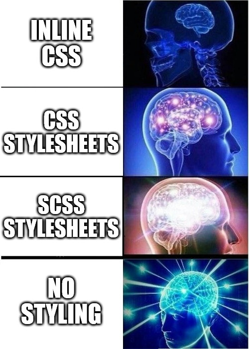

<a name="tiaras-html-theming-reference"></a>
# Tiara's HTML Theming Reference

A HTML theming reference implementation for CSS-first, frameworkless, static,
modular, yet modern and contemporary HTML-theming for traditionalist UNIX & GNU
enthusiasts.

This *HTML theme* not a standalone component. Even though it provides a
functional usability demonstration, its output is meant to be integrated into
other components, say a [Sphinx](https://www.sphinx-doc.org), or
[Wordpress](https://wordpress.org) theme.

This repository serves as a personal reference implementation and demonstration
of HTML theming principles. It is shared in the spirit of openness, with no
immediate plans for external contributions.

## Why?

It all started with my frustration over setting up my own personal website. I've
tried so many different options: Self-hosted CMS like Wordpress, micro-blogging
sites like Blogspot/Blogger, SaaS services. They all were too complicated for
what I wanted: A couple of multimedia webpages with some easter eggs here and
there. Easy to manage, robust, light on bandwidth, yet highly customizable and
contemporary. Ready-made solutions and frameworks just didn't cut it for me.
Issues such as spaghetti code, intrusive telemetry, and overly complex styling
and scripting, to name a few... My resolution? Start from scratch. Like really
from scratch: Open an empty HTML document, then think about what I'm going to do
next...

One thing that came very clear to me was that I wanted an approach that was
modular, where I could focus on one thing at a time. HTML theming is HTML
theming, the backend is the backend, and so on...

## Why share?
<p align=center>
    
</p>

The Gurus I look up to have one thing in common: There websites look awful (to
me) and they argue there being no other way, while staying true to UNIX and
libertarian principles. I want to challenge that assumption and provide a
reference for upholding said principles, while using modern web design &
development techniques.

The reference implementation does no bundling, only transpiles, optimizes and
minifies sources. Build subsystems are loosely coupled. The build environment is
unified and only requires a single runtime environment (Node.js). The interface
to the build environment is tradtional GNU (Make and Autoconf) and (very) easy
to integrate into CI services, without compromising on facilities of local
development.

The reference implementation adheres to matured web design and development
principles, such as the Sass 7:1 pattern, W3C Accessibility standard, HTML5
specification, SMACSS, non-dogmatic test-driven development.

It tries (very hard) to stay true to UNIX principles. I've chosen each subsystem
to do just one thing and do it well. But most importantly, it respects the end
user and ownership of their browser.

The repository seems overwhelming? That's just because I'm not trying to hide
the complexities of modern web development. Quite the opposite - I'm exposing
them and just add a very thin abstraction layer on top which is known to
traditionalist UNIX & GNU enthusiasts.

## Usage

```
sh ./configure
```

It automatically checks for required programs. If any are missing, the script
halts and provides guidance on how to resolve the issue

```
make
```

That's all. You will find a tarball distribution containing all assets,
including a usability demonstration under `_docs/` within it.

Refer to the Makefile for insights into my development principles and workflows.
Documentation is scattered throughout the sources and each directory within this
repository.

<a name="licensing"></a>
## Licensing

Sharing is caring! This project is licensed under a Creative Commons Attribution
4.0 International License, as my focus is on providing services rather than
monetizing products.

You should have received a copy of the license along with this
work. If not, see <https://creativecommons.org/licenses/by/4.0/>.
